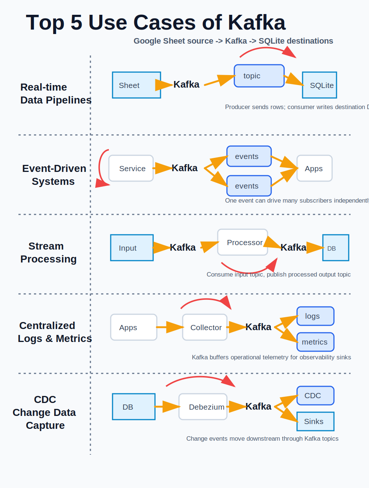

# kafka-app

Python examples for five Kafka use cases using a real Kafka broker.



Data path:

`Google Sheet -> Kafka topic(s) -> Python consumer/processor -> SQLite`

Source Google Sheet:

`https://docs.google.com/spreadsheets/d/1hMG0ayX_RwlASEVjR2GNMSfFp3UmVlIiOyT0WWCtQHo/edit?usp=sharing`

## Setup

From the repo root:

```powershell
python -m venv .venv
.\.venv\Scripts\Activate.ps1
python -m pip install -r requirements.txt
```

If PowerShell blocks activation scripts, run:

```powershell
Set-ExecutionPolicy -Scope Process -ExecutionPolicy Bypass
.\.venv\Scripts\Activate.ps1
```

## Start Kafka

This repo includes a single-node Kafka broker using Docker Compose.
Docker Desktop must be running before this command works on Windows.

```powershell
docker compose up -d
```

The default broker address is:

`localhost:9092`

Optional override:

```powershell
$env:KAFKA_BOOTSTRAP_SERVERS = "localhost:9092"
```

Stop Kafka:

```powershell
docker compose down
```

## Source Configuration

The default Google Sheet is configured in `app_common.py`.

Optional environment variables:

```powershell
$env:GOOGLE_SHEET_ID = "1hMG0ayX_RwlASEVjR2GNMSfFp3UmVlIiOyT0WWCtQHo"
$env:GOOGLE_SHEET_GID = "0"
```

Use `GOOGLE_SHEET_GID` when reading a different sheet tab.

## Apps

### 1. Real-time Data Pipeline

Publishes Google Sheet rows to Kafka, then consumes the topic into SQLite.

```powershell
python .\real_time_data_pipelines\main.py
```

Kafka topic:

- `real-time-data-pipeline.events`

Destination:

- `real_time_data_pipelines\data\pipeline.sqlite3`
- Table: `pipeline_events`
- View: `latest_pipeline_events`

### 2. Event-Driven System

Detects row creates, updates, and deletes, publishes domain events to Kafka, then consumes them into SQLite.

```powershell
python .\event_driven_systems\main.py
```

Kafka topic:

- `event-driven-system.domain-events`

Destination:

- `event_driven_systems\data\events.sqlite3`
- Tables: `entity_state`, `domain_events`

### 3. Stream Processing

Publishes raw rows to an input topic, consumes them as a stream processor, writes aggregate results to an output topic, then consumes output metrics into SQLite.

```powershell
python .\stream_processing\main.py
```

Kafka topics:

- `stream-processing.input-events`
- `stream-processing.hourly-metrics`

Destination:

- `stream_processing\data\stream_processing.sqlite3`
- Tables: `processed_events`, `hourly_event_metrics`

### 4. Centralized Logs and Metrics

Builds log and metric records, publishes them to Kafka topics, then consumes those topics into SQLite.

```powershell
python .\centralized_logs_metrics\main.py
```

Kafka topics:

- `centralized-logs.logs`
- `centralized-logs.metrics`

Destination:

- `centralized_logs_metrics\data\logs_metrics.sqlite3`
- Tables: `app_logs`, `operational_metrics`

### 5. CDC Change Data Capture

Maintains a snapshot, detects inserts, updates, and deletes, publishes CDC events to Kafka, then consumes them into SQLite.

```powershell
python .\cdc_change_data_capture\main.py
```

Kafka topic:

- `cdc-change-data-capture.changes`

Destination:

- `cdc_change_data_capture\data\cdc.sqlite3`
- Tables: `source_snapshot`, `cdc_changes`

## Run All Apps

Start Kafka first:

```powershell
docker compose up -d
```

Then run:

```powershell
python .\real_time_data_pipelines\main.py
python .\event_driven_systems\main.py
python .\stream_processing\main.py
python .\centralized_logs_metrics\main.py
python .\cdc_change_data_capture\main.py
```

## Inspect Kafka Topics

Inside the Kafka container:

```powershell
docker exec kafka-app-broker kafka-topics.sh --bootstrap-server localhost:9092 --list
```

Read messages from a topic:

```powershell
docker exec kafka-app-broker kafka-console-consumer.sh --bootstrap-server localhost:9092 --topic real-time-data-pipeline.events --from-beginning --max-messages 5
```

## Inspect SQLite Data

With the SQLite CLI installed:

```powershell
sqlite3 .\stream_processing\data\stream_processing.sqlite3 "SELECT * FROM hourly_event_metrics LIMIT 10;"
```

Or open the `.sqlite3` files with any SQLite browser.
